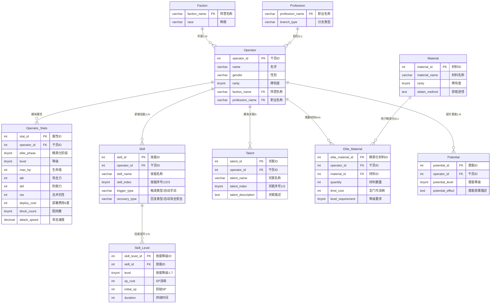

# 明日方舟干员数据库 ER图

## 实体关系图

## 实体说明

### 基础实体
- **Faction（阵营）**：游戏中的各个势力组织
- **Profession（职业）**：干员的职业分类
- **Material（材料）**：游戏中的升级材料

### 核心实体
- **Operator（干员）**：游戏角色主体信息

### 从属实体
- **Operator_Stats（干员属性）**：干员在不同阶段的数值属性
- **Skill（技能）**：干员拥有的技能
- **Skill_Level（技能等级）**：技能在不同等级的效果
- **Talent（天赋）**：干员的被动能力
- **Potential（潜能）**：干员的潜能提升效果
- **Elite_Material（精英化材料）**：干员精英化所需材料清单

## 关系说明

1. **所属（1:N）**：一个阵营包含多个干员
2. **担任（N:1）**：多个干员担任同一职业
3. **拥有属性**：一个干员有多条属性记录
4. **掌握技能（1:N）**：一个干员掌握多个技能（最多3个）
5. **技能提升（1:N）**：一个技能有多个等级（1-7级）
6. **拥有天赋（N）**：一个干员拥有多个天赋（最多2个）
7. **需要材料（N:N）**：干员与材料的多对多关系
8. **用于精英化（N:1）**：材料用于多个干员的精英化
9. **提升潜能（1:N）**：一个干员有多个潜能等级（1-6级）
